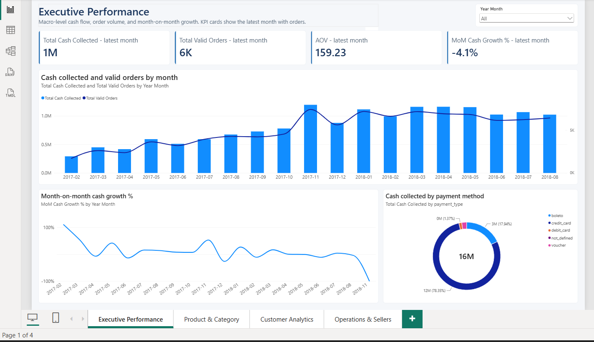
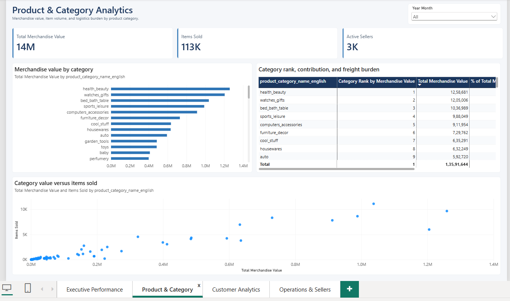
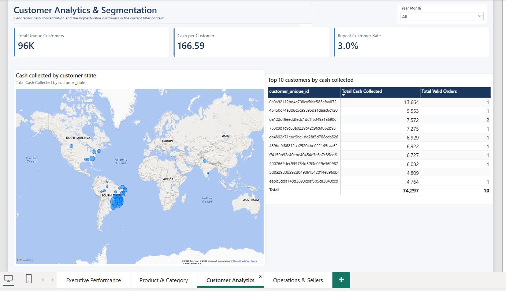
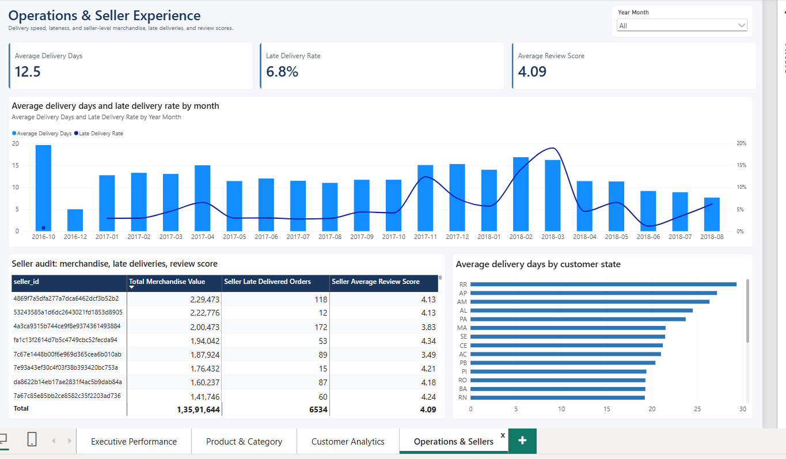

# Olist E-Commerce Sales & Operations Analysis

**Tools:** PostgreSQL, SQL, Power BI, DAX, Power Query

## Project Overview
An end-to-end business analysis of the Brazilian E-Commerce Public Dataset by Olist. This project moves beyond standard dashboarding by utilizing structured SQL queries and dimensional data modeling to investigate marketplace performance, customer retention, category profitability, and logistics efficiency.

## What I Built
*   **Database & Analytics Pipeline:** Loaded raw data into PostgreSQL and engineered 18 business-focused SQL queries utilizing CTEs, window functions, and time-series logic.
*   **Semantic Data Model:** Designed a robust star schema in Power BI separating distinct grains (fact_orders, fact_payments, fact_reviews) to prevent aggregation errors.
*   **Interactive Executive Dashboard:** Built a 4-page Power BI report featuring custom DAX measures for YoY/MoM growth, freight burden ratios, and delivery performance tracking. 

## Key Business Findings

*   **Customer Retention is Critically Low:** Only ~3% of unique customers placed more than one valid order. The platform operates almost entirely on one-time purchasers, indicating a massive missed opportunity for LTV growth.
*   **Payment Concentration Risk:** Credit cards (78%) and Boletos (18%) dominated transactions. These two methods processed over 96% of all cash collected, highlighting where payment infrastructure stability matters most.
*   **Volume vs. Value Disconnect:** Item volume does not strictly correlate with revenue. For example, `bed_bath_table` drove massive item volume, while `watches_gifts` generated higher total merchandise value with a fraction of the orders. 
*   **Stagnant Growth in 2018:** Following a strong trajectory in 2017, monthly cash collection plateaued around 1.0M–1.1M through the first eight months of 2018, requiring deeper cohort analysis to diagnose.
*   **Fulfillment Bottlenecks:** Late delivery rates spiked sharply in February–March 2018, exceeding 18% in March despite order volumes remaining relatively stable, severely impacting customer review scores.

## Repository Structure

```text
olist-ecommerce-sales-analysis/
│
├── README.md
├── PowerBI/
│   ├── Olist_Ecommerce_Dashboard.pbip
│   └── Olist_Ecommerce_Dashboard.SemanticModel/
├── sql/
│   ├── 01_schema.sql
│   ├── 02_data_validation.sql
│   └── 03_business_analysis.sql
└── Screenshots/
    ├── 01_Executive_Performance.png
    ├── 02_Product_Category.png
    ├── 03_Customer_Analytics.png
    └── 04_Operations_Seller.png

Dashboard Preview

Executive Performance



Product & Category Analytics



 Customer Analytics



 Operations & Seller Experience



